# [Outreachy 2026] RamaLama exploration on Linux Mint 22

## Overview
This document is my solution for issue [#124](https://forge.fedoraproject.org/commops/interns/issues/124): **[Outreachy 2026] RamaLama: learn how RamaLama makes working with AI boring**.

**Assignment goal:** install RamaLama, verify the version, pull and run models using different transports, and analyze both successful results and failures with reasoning.

## Summary
I completed this assignment using **two approaches**:
1. Inside a Podman container
2. On host using Python `venv` + Podman

I documented exact commands, outputs, failures, and troubleshooting for both. The container-first path exposed early environment limitations, while host + `venv` became the stable path for deeper testing. I also compared three RamaLama transports: Ollama, Hugging Face, and OCI.

## System setup
| Item | Value |
|---|---|
| OS | Linux Mint 22.3 |
| Container Engine | Podman 4.9.3 |
| RAM | 8 GB |
| Python | 3.12.3 |
| GPU | CPU-only |
| RamaLama | 0.18.0 |

---

## Approach 1: Running inside Podman container (initial attempt)

I first tried running RamaLama inside a generic Python container image (`python:3.12`) using Podman.

### Step 1: Install Podman
**Goal:** Install container engine required for RamaLama container workflows.
```bash
sudo apt install podman -y
```
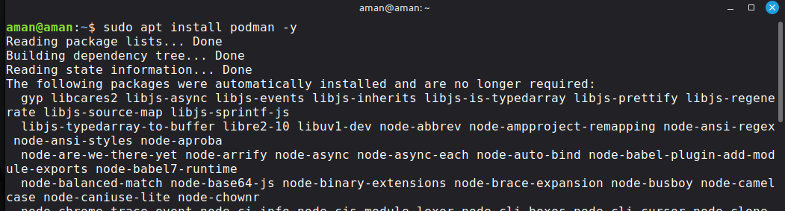

### Step 2: Verify Podman installation
**Goal:** Confirm Podman is installed and available in `PATH`.
```bash
podman --version
```
**Output:**
- `podman version 4.9.3`
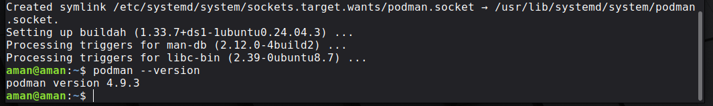

### Step 3: Pull Python container image
**Goal:** Prepare a clean container to test RamaLama inside container first.
```bash
podman pull docker.io/library/python:3.12
```
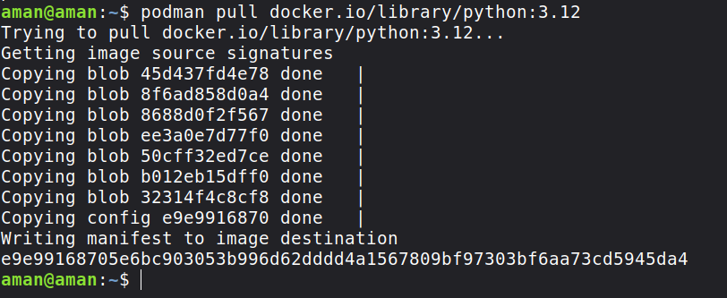

### Step 4: Start Python container shell
**Goal:** Enter the container and run RamaLama setup commands there.
```bash
podman run -it python:3.12 bash
```
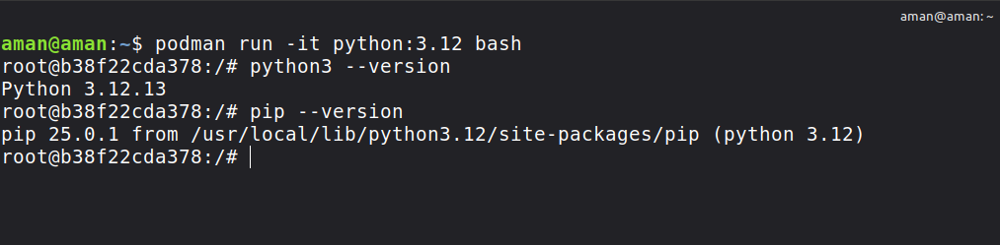

### Step 5: Install RamaLama inside container
**Goal:** Install RamaLama CLI in container for Method 1 testing.
```bash
pip install ramalama
```
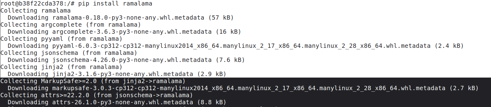

### Step 6: Verify RamaLama in container
**Goal:** Verify RamaLama command works after installation.
```bash
ramalama version
```
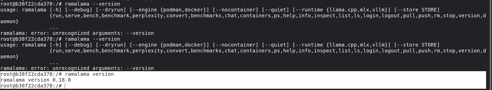

Note: I initially ran `ramalama --version`, but it returned an error in this container flow. Then I used `ramalama version`, which worked.

### Step 7: Install Ollama inside the container
**Goal:** Install Ollama backend inside container before pulling Ollama transport models.

```bash
curl -fsSL https://ollama.com/install.sh | sh
```
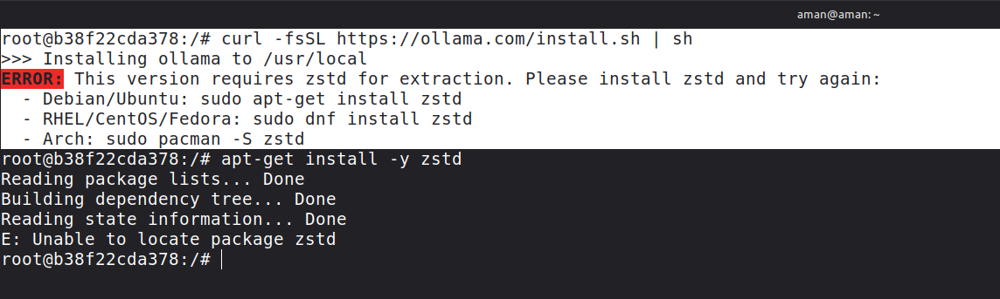

**Output:**
- Installer failed first because `zstd` was missing.
- Key raw line: `ERROR: This version requires zstd for extraction.`

```bash
apt-get install -y zstd
```

**Output:**
- Initially failed with `Unable to locate package zstd`.
- Key raw line: `E: Unable to locate package zstd`

Then I ran:

```bash
apt-get update
apt-get install -y zstd
curl -fsSL https://ollama.com/install.sh | sh
ollama --version
```
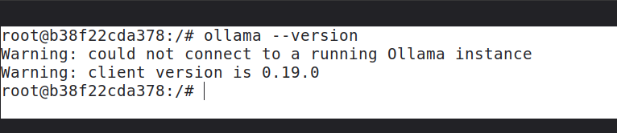

**Result:**
- Ollama installed successfully inside the container.
- Key raw line: `ollama version ...`

### Step 8: Pull and run model inside container
**Goal:** Validate whether model pull/run works in containerized Method 1 flow.

```bash
ramalama pull ollama://gemma:2b
```
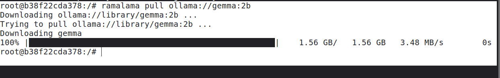

```bash
ramalama run ollama://gemma:2b "What are the Four Foundations of the Fedora project?"
```
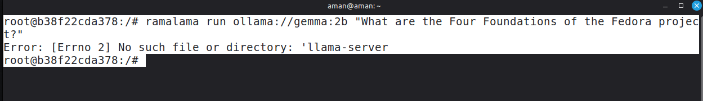

**Observed issue:**
- `Error: [Errno 2] No such file or directory: 'llama-server'`
- Key raw line: `ramalama run ... -> No such file or directory: 'llama-server'`

**Analysis:**
- Running RamaLama inside a generic Python container was not reliable for my setup.
- I moved to host-based execution, where troubleshooting (`--nocontainer` vs container mode with `crun`) was clearer and more reproducible.

---

## Approach 2: Host + venv + Podman (main working flow)

I switched to host terminal and used `venv` environment with Podman available.

Since I am using Linux Mint, Python 3 is preinstalled. I created and activated a virtual environment, then installed RamaLama inside it:

### Step 1: Create and activate virtual environment
**Goal:** Create isolated Python environment on host for reliable RamaLama testing.
```bash
python3 -m venv ramalama-env
source ramalama-env/bin/activate
```

### Step 2: Install RamaLama in virtual environment
**Goal:** Install RamaLama in host `venv`.
```bash
pip install ramalama
```
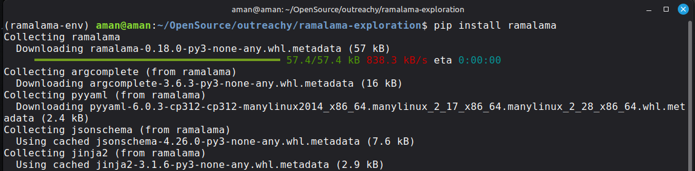

### Step 3: Verify RamaLama version
**Goal:** Confirm host setup is ready before transport testing.
```bash
ramalama version
```
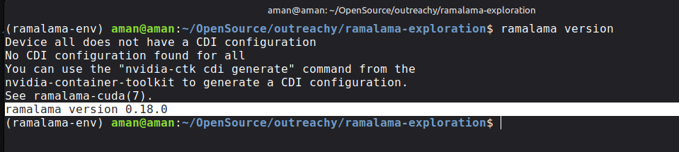

**Output:**
- `ramalama version 0.18.0`

---

## Transport 1: Ollama (`ollama://`)

### Step 4: Pull model from Ollama transport
**Goal:** Pull first model via Ollama transport as required by assignment.
**Initial attempt (failed):**

```bash
ramalama pull ollama://gemma:2b --nocontainer
```
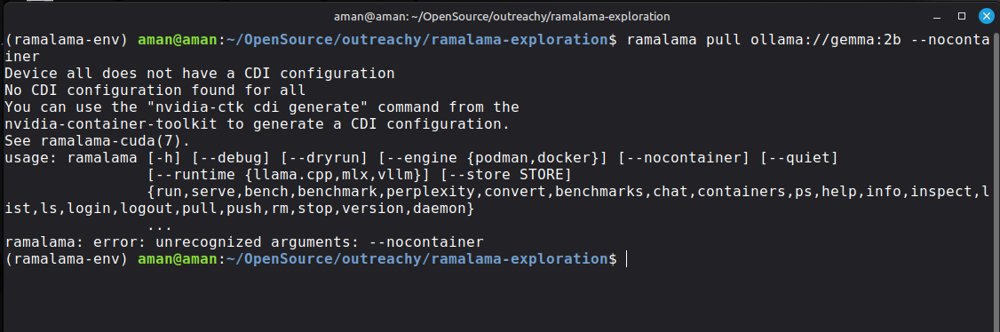

This failed with:
- `ramalama: error: unrecognized arguments: --nocontainer`
- Key raw line: `usage: ramalama ... error: unrecognized arguments: --nocontainer`

**Reason:**
- `--nocontainer` is a global flag and must appear before the subcommand.
- Also, `pull` does not need `--nocontainer`; it is mainly relevant for `run/serve`.

```bash
ramalama pull ollama://gemma:2b
```
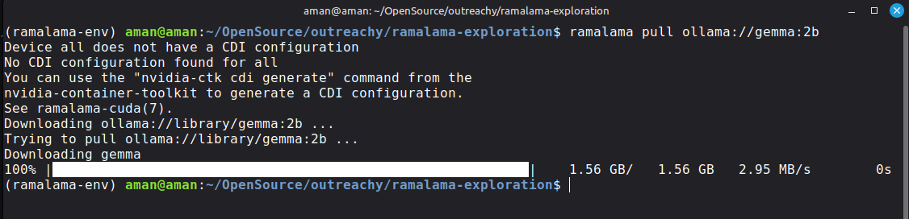

**Output:**
- `Downloaded ollama://library/gemma:2b successfully (1.56 GB).`
- Key raw lines: `Downloading ollama://library/gemma:2b ...`, `100% ... 1.56 GB`

### Step 5: Run model from Ollama transport
**Goal:** Run pulled Ollama model with Fedora Foundations prompt.
```bash
ramalama run ollama://gemma:2b "What are the Four Foundations of the Fedora project?"
```
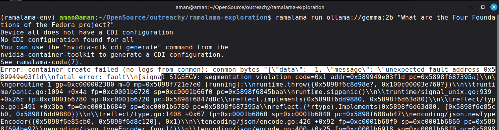
**Output (error summary):**
- `Error: container create failed ...`
- `fatal error: fault [SIGSEGV]` from `runc`
- `Error: Failed to serve model gemma`
- Key raw line: `fatal error: fault [signal SIGSEGV ...]`

**Analysis:**
- This failure was from container runtime (`runc`) crash, not prompt syntax.
- I then tested two different recovery paths.

Alternate attempt with `--nocontainer`:

```bash
ramalama --nocontainer run ollama://gemma:2b "What are the Four Foundations of the Fedora project?"
```
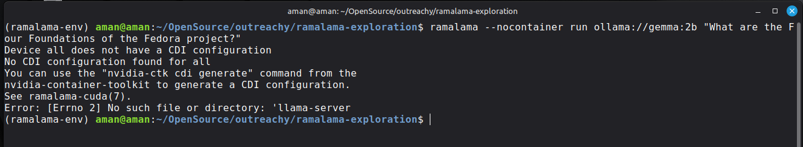

**Output:**
- `Error: [Errno 2] No such file or directory: 'llama-server'`
- Key raw line: `No such file or directory: 'llama-server'`

**Reason:**
- `--nocontainer` requires a local `llama-server` binary on host.
- Since `llama-server` was not installed/in `PATH`, this path failed.

### Step 6: Resolve runtime issue using `crun`
**Goal:** Bypass `runc` crash by switching OCI runtime backend.
To address the runtime crash, I installed `crun` and forced RamaLama to use it:

```bash
sudo apt install -y crun
```
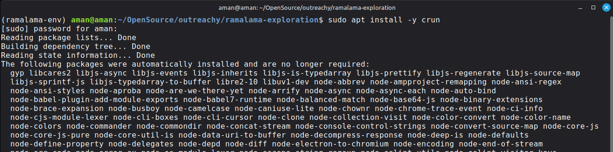

**Why `crun`:**
- `podman` is the container engine, and `crun` is the low-level OCI runtime it uses to start containers.
- They are related as: `RamaLama -> Podman -> crun/runc`.

```bash
ramalama run --oci-runtime crun ollama://gemma:2b "What are the Four Foundations of the Fedora project?"
```
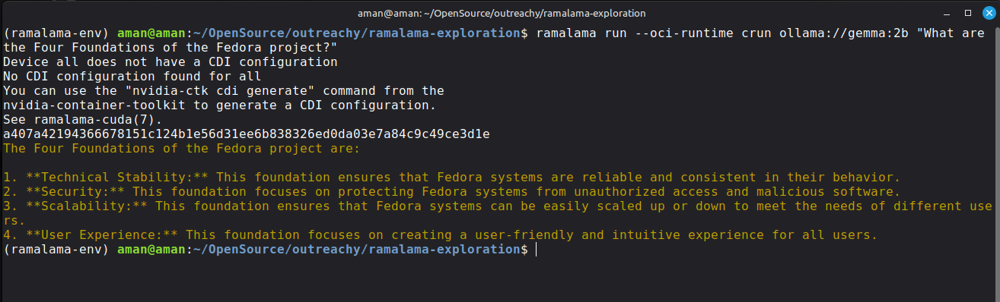

**Output:**
- Command executed successfully, but the model response was factually incorrect for Fedora Foundations.
- Key raw line: model returned non-official foundations (not `Freedom, Friends, Features, First`).

### Step 7: Compare additional Ollama models
**Goal:** Compare answer quality across other Ollama models.
I also tested:

```bash
ramalama pull ollama://llama3.2:3b
ramalama run ollama://llama3.2:3b "What are the Four Foundations of the Fedora project? Give only the official four names."
```
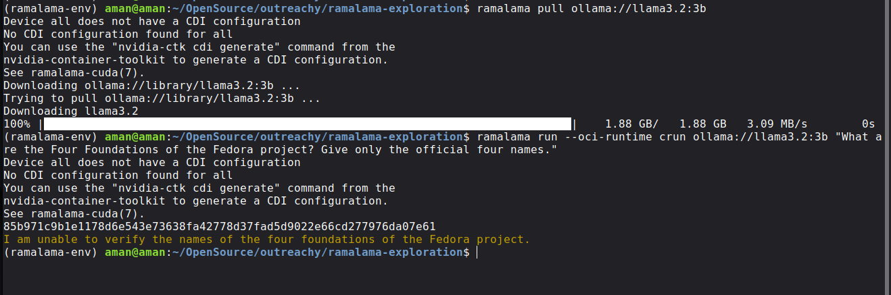

**Output:**
- `I cannot verify the names of the official four foundations of the Fedora project.`

And:

```bash
ramalama pull ollama://granite3.1-dense:2b
```
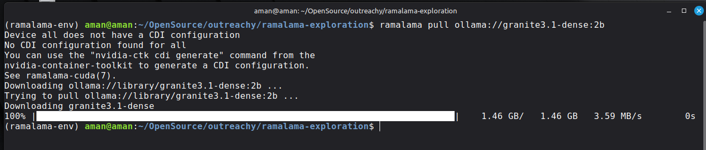

```bash
ramalama run --temp 0 ollama://granite3.1-dense:2b "Give only the official four Fedora Foundations names."
```
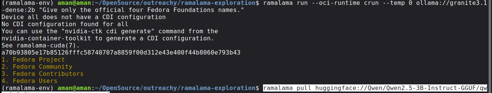

**Why `--temp 0`:**
- I used `--temp 0` to reduce randomness and make the answer deterministic.
- Without `--temp 0`, responses can vary more between runs and may be more creative/noisy, which is not ideal for factual checking.

**Output:**
- Still incorrect.
- Key raw line example: model returned non-official labels.

**Finding:**
- Ollama transport worked technically, but small local models were inconsistent on this Fedora-specific factual question.

---

## Transport 2: Hugging Face (`huggingface://`)

### Step 8: Pull model from Hugging Face transport
**Goal:** Test second transport with a different model source.
```bash
ramalama pull huggingface://Qwen/Qwen2.5-3B-Instruct-GGUF/qwen2.5-3b-instruct-q4_k_m.gguf
```
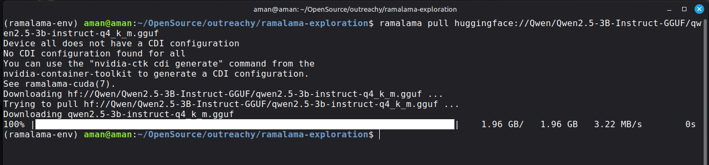

### Step 9: Run with open prompt
**Goal:** Evaluate baseline factual quality with less constrained prompt.
```bash
ramalama run --temp 0 huggingface://Qwen/Qwen2.5-3B-Instruct-GGUF/qwen2.5-3b-instruct-q4_k_m.gguf "Give only the official four Fedora Foundations names."
```
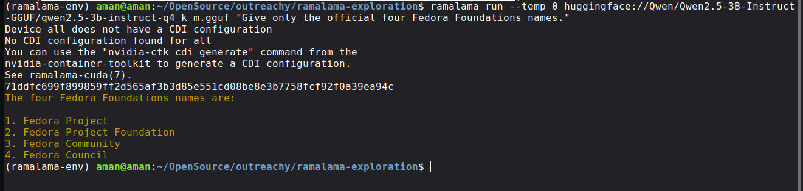

**Output:**
- Incorrect names.

### Step 10: Run with constrained prompt
**Goal:** Check whether prompt constraints improve factual correctness.
```bash
ramalama run --temp 0 huggingface://Qwen/Qwen2.5-3B-Instruct-GGUF/qwen2.5-3b-instruct-q4_k_m.gguf "What are Fedora's Four Foundations? Answer exactly as: Freedom, Friends, Features, First."
```
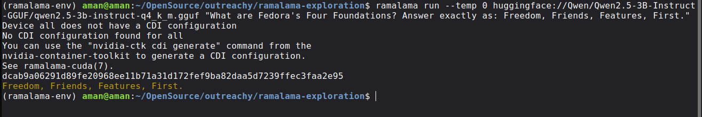

**Output:**
- `Freedom, Friends, Features, First.`

**Finding:**
- Hugging Face transport worked.
- Prompt design significantly changed factual output quality.

---

## Transport 3: OCI Registry (`oci://`)

### Step 11: Try pulling models from OCI registry
**Goal:** Test third transport (`oci://`) using public references.
I tested multiple OCI registry references:

```bash
ramalama pull oci://quay.io/ramalama/tinyllama
```
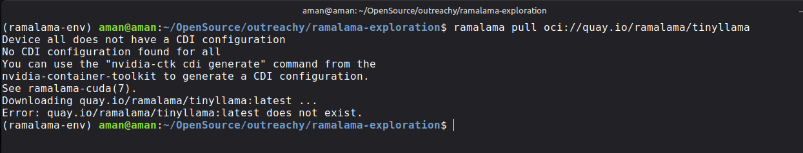

```bash
ramalama pull oci://quay.io/rhatdan/tiny:latest
```
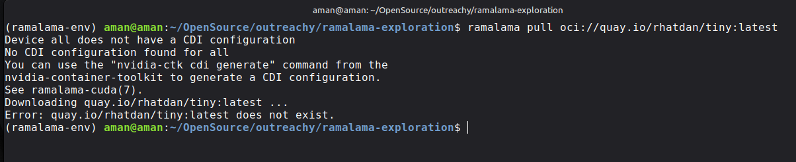

```bash
ramalama pull oci://quay.io/mmortari/gguf-py-example/v1/example.gguf
```
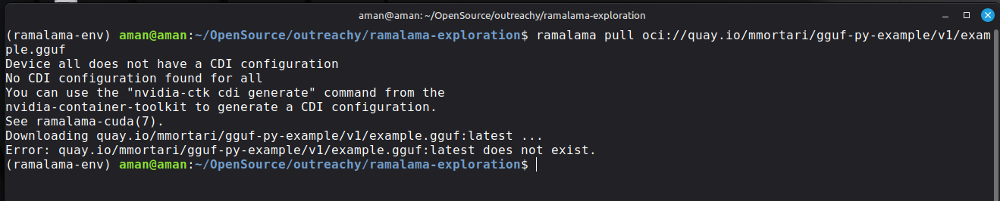

**Outputs:**
- All returned `does not exist` in my environment.
- Key raw line: `Error: ... does not exist.`

### Step 12: Try local OCI conversion
**Goal:** Create local OCI model artifact as OCI fallback path.
Then I tried local OCI conversion:

```bash
ramalama convert ollama://gemma:2b oci://gemma2b:latest
```
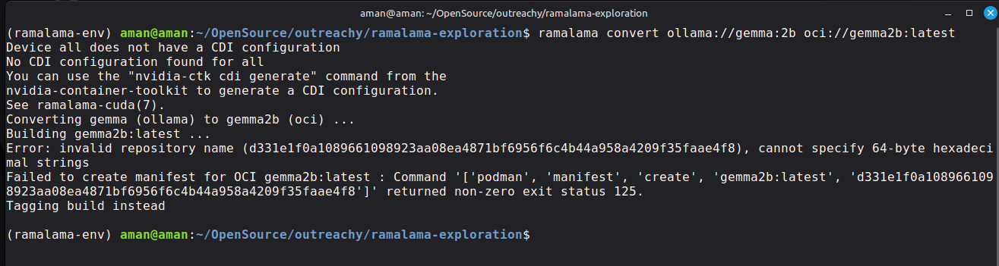

**Output:**
- Manifest creation error:
  - `invalid repository name ... cannot specify 64-byte hexadecimal strings`
  - `Failed to create manifest ...`
  - `Tagging build instead`

### Step 13: Verify local OCI image
**Goal:** Confirm converted/tagged image exists in Podman local store.
I confirmed a local image existed:

```bash
podman images | grep -Ei "gemma2b|smollm|oci"
```
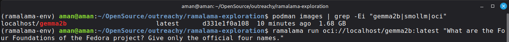

**Output:**
- `localhost/gemma2b latest ...`

### Step 14: Run local OCI model
**Goal:** Validate whether local OCI model can run end-to-end.
Then tried running:

```bash
ramalama run oci://localhost/gemma2b:latest "What are the Four Foundations of the Fedora project? Give only the official four names."
```
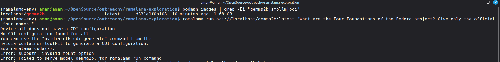

**Output:**
- `Error: subpath: invalid mount option`

**Finding:**
- OCI transport testing revealed real registry availability + runtime/mount issues in my stack.
- This was the most problematic transport on my setup.

---

## Additional debugging finding (`ramalama list`)

### Step 15: Debug `ramalama list` crash
**Goal:** Investigate and work around `ramalama list` failure.
`ramalama list` crashed with:

- `AttributeError: 'str' object has no attribute 'timestamp'`
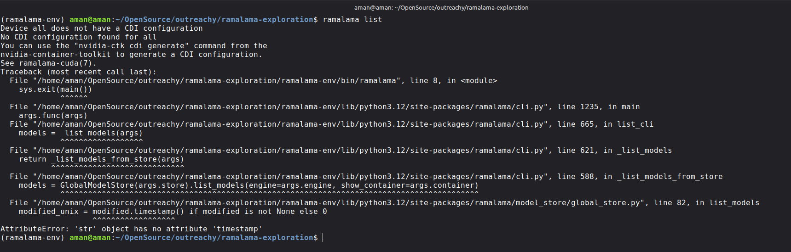

**Workaround:**

```bash
ramalama --nocontainer list
```
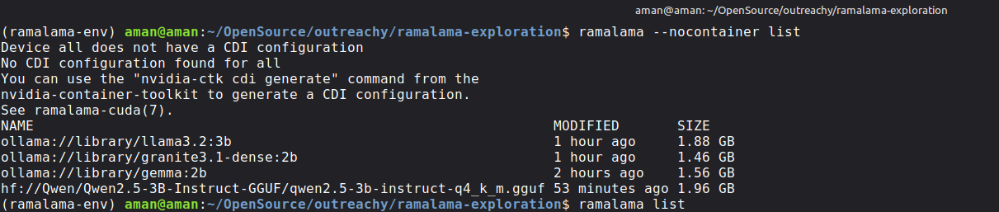

**Why this worked:**
- This issue appeared after OCI convert attempts, likely due to a container-image metadata type mismatch (`modified` value).
- `ramalama --nocontainer list` bypassed container-image metadata and listed only model-store entries.

This worked and listed my local Ollama/HF models.

---

## Comparison and evaluation

1. Ollama transport:
- Easy to use.
- Worked technically.
- Factual correctness was inconsistent across tested models.

2. Hugging Face transport:
- Also easy and reliable in my environment.
- With better prompt constraints, returned correct Fedora foundations.

3. OCI transport:
- Most difficult in my setup.
- Public OCI references tested were unavailable.
- Local OCI conversion/run exposed additional errors.

4. Model behavior:
- Bigger parameter count did not guarantee correct answer.
- Prompt structure (`--temp 0` + constrained answer format) improved results significantly.

5. Official expected answer used for evaluation:
- `Freedom, Friends, Features, First`

---

## Does RamaLama make working with AI "boring"?

Yes, in the way good tooling should. RamaLama gave me a repeatable workflow across transports (`pull`, `run`, and URI-based model selection), so I could focus more on testing and less on setup. Even when things failed, the command structure stayed consistent, which made debugging easier.

At the same time, this task proved that "easy to run" is not the same as "always correct." I hit real runtime issues (`runc` crash, missing `llama-server` in `--nocontainer`, OCI availability/mount problems), and I also saw that model answers could be wrong unless I improved prompt constraints. So my final view is: RamaLama makes the workflow boring in a good way, but model evaluation and system troubleshooting still require careful thinking and debugging.
